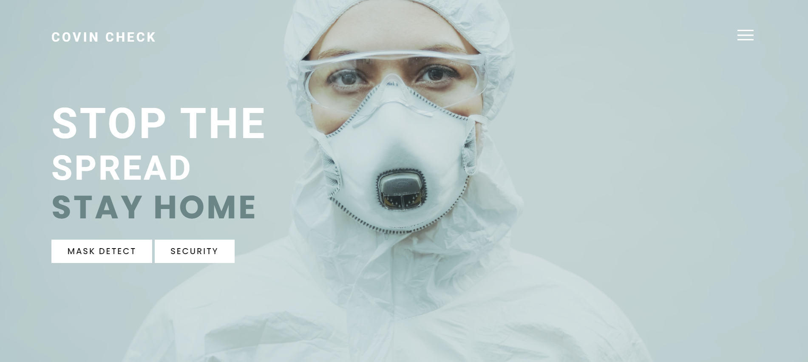

# Covid19-SafetyMeasureSystem

> This is project which is developed for the purpose of Covid-19 safety measure system. This project is developed using the following technologies

## Demo
[Check the website here](https://covidcheck.netlify.app/)

## Features

- Face Mask Detection 
- Temprature Check 
- Sanitization 

## Technologies

- HTML
- CSS
- JavaScript
- Tensorflow.js
- Firebase
